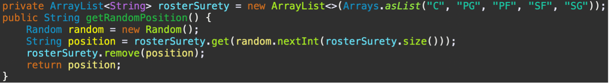

# NBA Game Simulation

## Part 1: General Demo Information

## List of Users
User 1:
Nickname: tahaekim
Password: A@a210620
Email: aekm@gmail.com
Name: Ahmet
Surname: Ekim
Age: 28
Profile Photo Path: /Users/a.tahaekim/git/Comp132-Project/comp_project/src/profile photos/a.jpg

User 2:
Nickname: cemrecsr
Password: A@a210620
Email: cemre@gmail.com
Name: Cemre
Surname: Cesur
Age: 25
Profile Photo Path: /Users/a.tahaekim/git/Comp132-Project/comp_project/src/profile photos/default.jpg

User 3:
Nickname: nazimata
Password: Mertemin2003@
Email: nata21@ku.edu.tr
Name: Nazim
Surname: Ata
Age: 31
Profile Photo Path: /Users/a.tahaekim/git/Comp132-Project/comp_project/src/profile photos/l.jpg

User 4:
Nickname: hasan
Password: Hasan61#
Email: hasan@gmail.com
Name: Hasan
Surname: Gunes
Age: 35
Profile Photo Path: /Users/a.tahaekim/git/Comp132-Project/comp_project/src/profile photos/k.jpg

User 5:
Nickname: bymanyaq
Password: Hanbayram#61
Email: han@gmail.com
Name: Bedirhan
Surname: Bayram
Age: 20
Profile Photo Path: /Users/a.tahaekim/git/Comp132-Project/comp_project/src/profile photos/m.jpg

User 6:
Nickname: talha
Password: Talha#25
Email: talha21@ku.edu.tr
Name: Talha
Surname: Saritepe
Age: 20
Profile Photo Path: /Users/a.tahaekim/git/Comp132-Project/comp_project/src/profile photos/c.jpg

## Application Usage Information

## 1.1 How to Start Application:
To initiate the application, execute the main method within the "TestLogin.java" file located at /Users/a.tahaekim/git/Comp132-Project/comp_project/src/gui/TestLogin.java. Running the application launches the graphical user interface, presenting a login window.

## 1.2 Sign up/Login Guide:
The application includes Login and Signup pages. Upon launching, the Login page prompts users to input their username and password. Successful login directs users to their profile page, while invalid credentials trigger an error message. The Signup page facilitates new account creation, allowing users to select a profile picture and input main and personal details. Validation ensures uniqueness of usernames and emails, with informative messages guiding users. A "Go Back" button allows users to return to the Login page without creating an account.

## 1.3 Profile Page:
The UserProfilePage displays the user's profile information upon login. Users can view and modify personal details, change their profile picture, select a team, view their selected team's details, and start a tournament. The page also facilitates signing out, returning users to the login screen.

## 1.4 Drafting Guide:

1.4.1 Team Selection:
The TeamSelectionPage allows users to select a basketball team before entering the drafting process. Users choose a team by clicking on the corresponding logo, and the selection is visually highlighted. Navigation buttons provide flexibility, allowing users to go back or proceed to the drafting phase. Upon selection, the system records the chosen team's logo path.

1.4.2 Player Selection:
The DraftingPlayers interface presents a table displaying available players for drafting. Users select players by clicking the "Select Player" button, and the "Done" button finalizes the drafting process. The algorithm ensures roster conditions for all teams before finalization. Detailed information about each player is accessible by interacting with the player table. The drafting process consists of multiple rounds, with the system randomly assigning players to other teams.

## 1.5 Match Making Guide:
The "Match Making" module simulates basketball matches within a GUI. The GUI initializes the tournament, managing regular season and playoffs. User controls allow pausing, viewing details, and resuming the tournament. Results are dynamically displayed, and the top 8 teams enter playoff simulation. The tournament concludes with the final match, and all results are saved for future reference.

## Part 2: Project Design Description
## 2.1 Class Relations:
In terms of user-related classes, the "User" class serves as the base class, featuring attributes such as nickname, password, name, surname, age, email, and a reference to a "Team" object. The "Team" class, in turn, encapsulates team-related information, including the team's name, logo path, a roster (a HashMap mapping positions to player lists), and performance statistics like wins, losses, and ties.

Within the "Player" package, there is a hierarchy of player classes, each representing a specific basketball position. The base "Player" class includes common attributes such as name, position, points, total rebounds, assists, blocks, steals, and a score. Subclasses like "Center," "PointGuard," "PowerForward," "ShootingGuard," and "SmallForward" extend the base "Player" class, inheriting its properties while specifying the basketball position.

The use of inheritance in the "Player" package adheres to a type hierarchy based on player positions, providing a clear and organized structure. This design allows for the extension and customization of player attributes specific to each position, facilitating code reuse. The "Team" class employs composition to manage a roster of players, utilizing a HashMap to categorize players by position. Additionally, the "Team" class features methods for adding players, calculating match statistics, and obtaining a random position from a predefined list.

## 2.2 GUI Components:
The GUI components play a pivotal role in crafting visually appealing and interactive user interfaces. In the context of Swing, a powerful library for building graphical applications in Java, various components are employed to create windows, panels, buttons, text fields, and other elements that enhance user experience1.

Consider the JFrame, a fundamental component serving as the main window or frame for the application. It encapsulates other GUI components, creating a container for the graphical interface. JPanel, on the other hand, acts as a container within the JFrame, facilitating the organization and arrangement of other components.

Text entry is made possible through JTextField, allowing users to input data, such as usernames and passwords. For secure password entry, JPasswordField is used, ensuring that password characters are concealed. JButton provides clickable buttons that trigger specific actions upon user interaction. Also, JLabels are utilized to display descriptive text, guiding users through the interface. The JToggleButton introduces a dynamic element, enabling the user to toggle between showing and hiding the password, enhancing flexibility and security.

Event handling is a crucial aspect of GUI programming, and ActionListener interfaces are implemented to capture and respond to user actions. For instance, when a login button is clicked, an ActionListener checks the entered credentials against stored data, while a signup button navigates users to a new page for account creation. The visual appeal is further enriched by incorporating images using ImageIcon, and the layout managers, such as null layout and grid layout, contribute to the proper alignment and arrangement of components within the GUI.

## 2.3 CSV File Processing and Scoring Algorithm:
The provided CSV file containing NBA player statistics for the 2022-2023 season. The heart of the operation lies in the PlayerCreator class, which diligently reads the CSV file, parsing each line to extract crucial player details like name, team, position, and performance metrics by using BufferedReader.2 This class parses the player objects coming from the csv file according to their positions and determines which subclass of the player class they belong to. Also, while reading the file PlayerCreator undertake the duplicate entries by selecting TOTs.(Figure 1) Additionally, when the entire file is processed, it returns an arraylist with all the players. 

*Figure 1*

The scoring logic is in the weightCalculator method, where a weighted value is computed for specific player statistics. This calculated score considers various factors, such as points, total rebounds, assists, blocks, and steals. Each category is assigned a specific weight (N) to reflect its relative importance in player performance assessment.(Figure 2) The algorithm then introduces an element of randomness by generating a random double within a specified range. In this way, when each player is created, the score is generated randomly.

*Figure 2*

## 2.4 Drafting Algorithm:
The DraftingPlayers class implements a comprehensive player drafting algorithm for a basketball simulation game. The graphical user interface facilitates user interaction in selecting players for their team, while also automating the player selection process for other teams. The algorithm operates in rounds, with each round representing a turn for each participating team to make a player selection. The drafting rounds are capped at 15, ensuring a fair and dynamic drafting process.

For the user's team, player selection is user-driven, allowing the user to choose a player based on displayed information in a table. The algorithm ensures that the user's team adheres to roster conditions, rejecting selections that do not satisfy the requirement of having players for all five positions. In contrast, for other teams, the algorithm employs a randomized approach to player selection. The randomness is introduced differently in the first five rounds compared to subsequent rounds, adding variety to the drafting process. In the initial rounds, teams are assigned players based on their preferred positions, enhancing strategic diversity in team composition. As the drafting progresses beyond the fifth round, randomness is introduced without considering position preferences, further diversifying team compositions.(Figure 3)

*Figure 3*

The algorithm continuously updates the graphical user interface, displaying real-time information about the drafting progress, selected players, and the current round. Additionally, a team log is generated, summarizing the drafted players for each team, and saved as a text file for future reference.

## 2.5 Regular Expressions:

In the user profile page, regular expressions (regex) are employed for validating and updating user information. Specifically, regex patterns are used to enforce certain constraints on user input, ensuring that the entered data adheres to predefined rules.3 The isValidPassword method utilizes a regex pattern to check if a new password meets the criteria of containing at least one letter, one digit, and one special character, with a minimum length of 8 characters. Similarly, the isValidEmail method employs a regex pattern to validate email addresses, verifying that they follow the standard format with proper characters and domain structure. These regex checks are essential for maintaining data integrity and security, providing a structured approach to input validation within the user profile page.

## 2.6 Predefined Sample Images:
The PhotoSelectionPage class represents a dialog for selecting a profile photo from a predefined set of sample images.4 The dialog features a grid layout containing buttons, each corresponding to a sample photo. Users can choose a photo by clicking on the associated button, and the selectedImagePath variable stores the path to the chosen image for later use. Upon selecting a photo, users can proceed to the next page or take appropriate actions, and a confirmation message is displayed. The dialog also includes a "Continue" button to facilitate the transition to subsequent pages. Additionally, if users attempt to proceed without selecting a photo, a warning message is displayed to prompt them to make a selection.

# References
1-	https://help.eclipse.org/latest/index.jsp?topic=%2Forg.eclipse.wb.doc.user%2Fhtml%2Findex.html

2-	https://copyprogramming.com/howto/reading-csv-file-using-bufferedreader-resulting-in-reading-alternative-lines#reading-csv-file-using-bufferedreader-resulting-in-reading-alternative-lines

3-	https://www.w3schools.com/java/java_regex.asp

4-	https://www.behance.net/awaisali13

5-	https://www.tutorialspoint.com/java/java_documentation.htm

